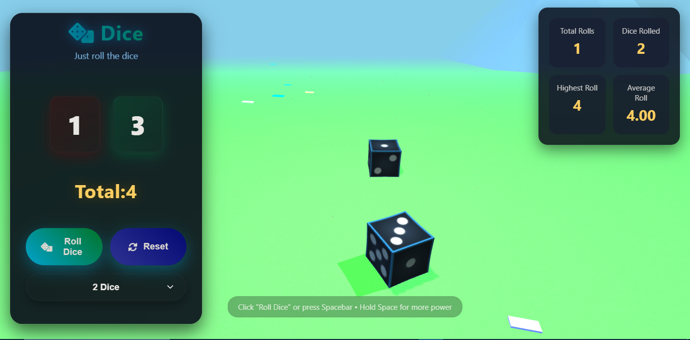

# 🎲 Dice Roller 3D

Welcome to Dice Roller 3D – a fun and interactive dice game on the web!  
You can roll one or two dice with realistic physics and beautiful 3D graphics.

---

## 🌟 Features

- 🎲 Roll 1 or 2 dice in 3D
- ⌨️ Press the spacebar or click to roll
- 🔋 Hold spacebar for more power
- 📊 Live stats: total rolls, highest roll, average
- 🌄 Animated environment: grass, sun, butterflies, mountains
- 🎨 Modern design with smooth UI
- 📱 Works on desktop and mobile

---

## 🧪 Technologies

- HTML5 + CSS3
- JavaScript (ES6+)
- [Three.js](https://threejs.org/) – 3D rendering
- [Cannon-es](https://pmndrs.github.io/cannon-es/) – Physics engine

---

## 🚀 Getting Started

To run the project:

1. Download or clone this repo
2. Open `index.html` in your browser

No installation needed!

---

## 📸 Screenshots

> _Add your screenshots here if you have them for better presentation_

---

## 📚 Use Cases

- Learn how physics works in 3D
- Play a virtual dice game
- Practice math and probability
- Learn about WebGL and 3D design

---

## 🙌 Credits

Made with 💻 and ☕ by [Hamza Sayed (Asyut Hack Club)]  
Thanks to open-source libraries: Three.js and Cannon-es

---

## 📄 License

This project is licensed under the MIT License.  
Feel free to use or improve it!
